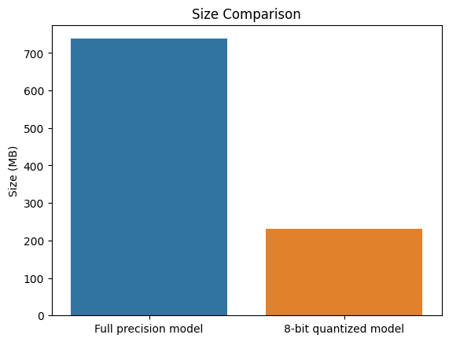

# lean-ai-detector

A lightweight AI text detector model based on Deberta-V3-base. Trained using a subset of the data generated during Learning Labs AI-text-detection competition.

Link to original model - [AI Text Detector](https://huggingface.co/norsu/ai-text-detector) 
Link to quantized model - [Lean AI Detector](https://huggingface.co/norsu/lean-ai-detector-quant)

## To-do

-[ ] notebook to scripts conversion  
-[ ] further training  
-[ ] preprocess before quantization  